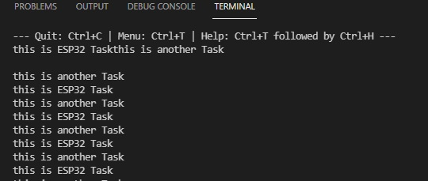

# PRACTICA 4: SISTEMAS OPERATIVOS EN TIEMPO REAL

## INFORME PARTE A

### Salida por el puerto serie

A continuación podemos ver el resultado de la salida por el puerto serie:

<!--Images-->

### Funcionamiento

Primero de todo  tenemos el setup donde inicializamos el serial con la valocidad de monitor de 9600, y creamos una tarea con el nombre "another Task", (con 10000 bytes de tamaño de pila) de la cual se define la base mas adelante. Para crear la tarea se utiliza el xTaskCreate() por tanto hay libertad para elegir el nucleo que ejecutara la tarea.

Seguidamente esta el loop, un bucle infinito que se ocupa de mostrar en el terminal el mensaje "this is ESP32 Task" con delay de 1000 entre mensajes, que es ejecutado por el ESP32 loopTask de Arduino. 

Mas adelante tenemos la función anotherTask que sera ejecutada cada vez que se cree una tarea nueva y lo que hara es, mediante un bucle infinito, mostrar en el terminal el mensaje "this is another Task" con delay de 1000.

Por ultimo hay una instrucción para terminar la tarea, aunque no se ejecutara nunca ya que esta detras de un bucle infinito.

Como podemos ver en la imagen anterior, en la salida por el puerto serie primero vemos el mensaje "this is ESP32 Task", eso se debe a la entrada en el loop una vez creada la tarea, a consecuencia de esto la funcion anotherTask es llamada y tambien entra en bucle, mostrando por el puerto serie "this is another task". Por lo tanto se ven alternados los mensajes en la salida sin detenerse.
